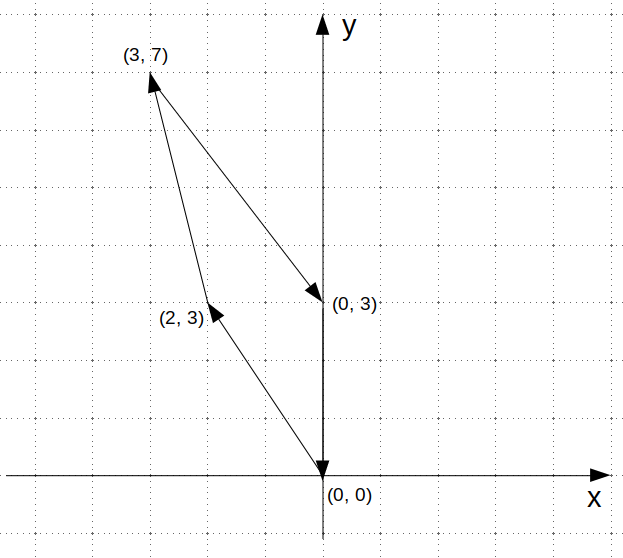

CNC mašina seče materijal tako što se glava mašine sa sečivom kreće po zadatim koordinatama.
Napisati program u kom korisnik učitava po ``n`` elemenata u dva niza od 30 realnih elemenata.
Prvi predstavlja ``x``, a drugi niz ``y`` koordinate tačaka po kojima se glava mašine kreće pravolinijski.
Glava mašine kreće se od tačke do tačke, u zadatom redosledu.
Ispisati xy parove koordinata, gde je svaki odgovarajući par oivičen zagradama, a parovi predstavljeni kao niz elemenata.
Izračunati ukupnu distancu koju glava mašine pređe za zadate tačke i rezultat ispisati na ekran Terminala.
Napraviti zaštitu unosa broja elemenata, tako da ``n`` bude u zadatim granicama veličine niza.

Euklidsko rastojanje između dve tačke u dvodimenzionalnom prostoru:

.. math::

   d = \sqrt{(x_{1} - x_{2})^2 + (y_{1} - y_{2})^2}

Primer rada programa:

.. literalinclude:: ispis-programa.txt
   :language: none

   Slika 1. Putanja glave CNC mašine iz primera rada programa
